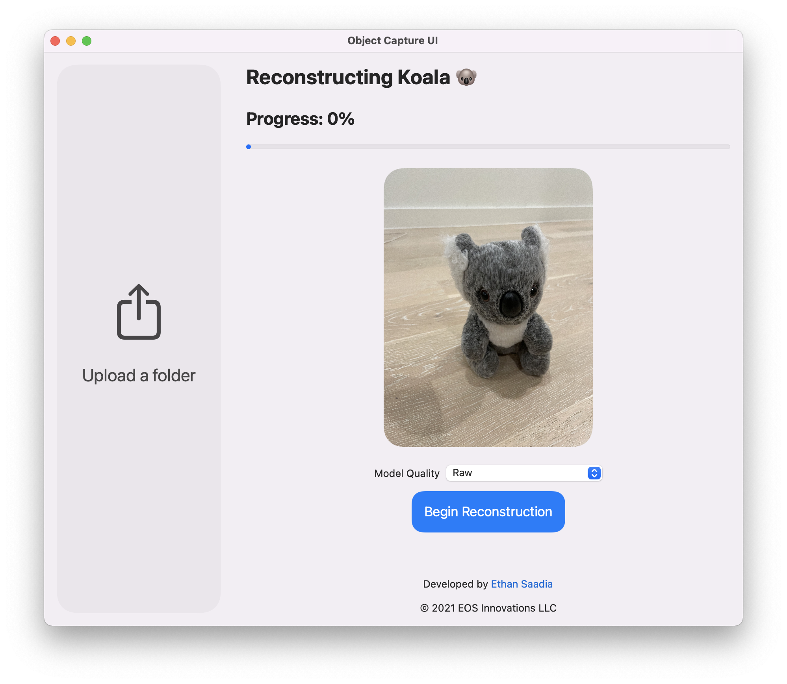

# PhotoCatch by [Ethan Saadia](http://twitter.com/ethansaadia)
## A graphical interface for Object Capture on macOS, previously known as Object Capture UI.

## [Download PhotoCatch](https://bit.ly/3cPxgpZ)
Beta version 0.1.0

## Features
- Select a folder of images 
- Choose from 5 levels of quality – Preview, Reduced, Medium, Full, and Raw
- Full control over all Object Capture parameters
- Reconstruct a 3D model with one click
- Save the model to a .usdz file
