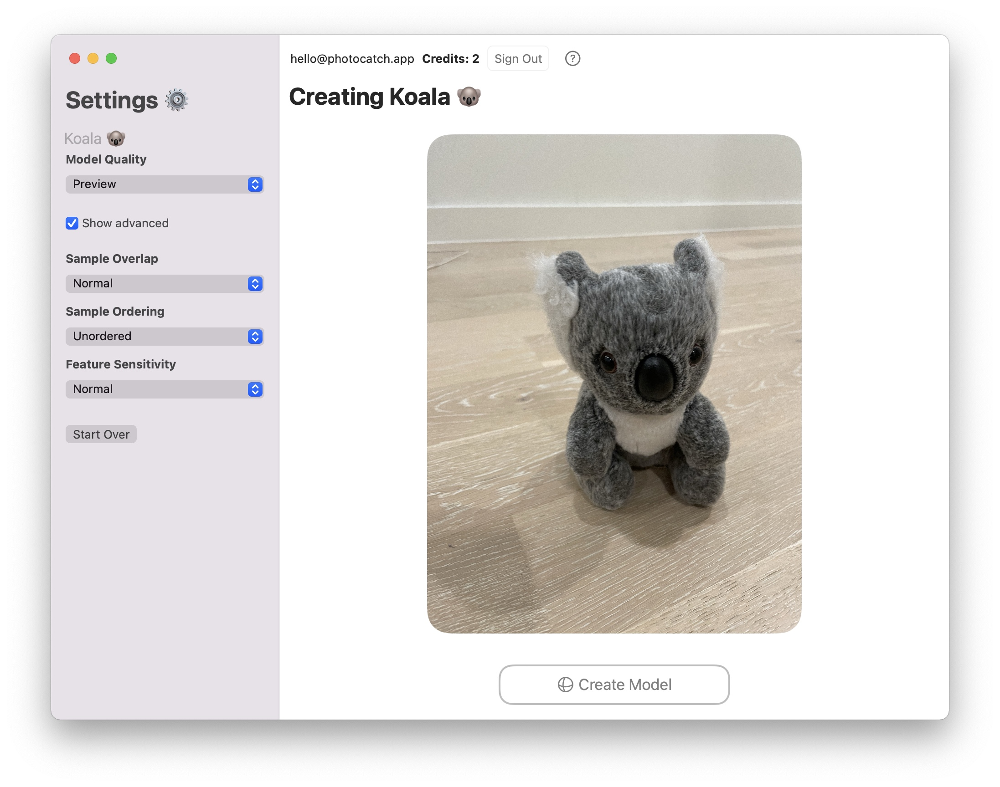

# PhotoCatch by [Ethan Saadia](http://twitter.com/ethansaadia)
## A graphical interface for Object Capture on macOS, previously known as Object Capture UI.

## [Download PhotoCatch](https://bit.ly/photocatch0131)
### Requires macOS 12 Monterey Beta 2
Beta version 0.1.3.1

#### [Download PhotoCatch Legacy](https://bit.ly/3hd8K3D)
**Compatible with macOS 12 Monterey Beta 1**

Beta version 0.1.2

## Features
- Select a folder of images 
- Choose from 5 levels of quality – Preview, Reduced, Medium, Full, and Raw
- Full control over all Object Capture parameters
- Reconstruct a 3D model with one click
- Save the model to a .usdz file

# 🚨 Requirements
### macOS 12 Monterey Beta
- Apple Silicon Mac
- OR Intel Mac with 16GB of RAM + AMD GPU with **4GB VRAM**
